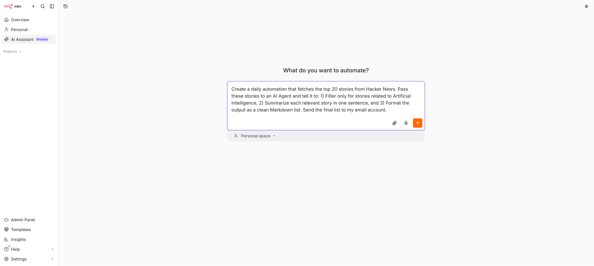
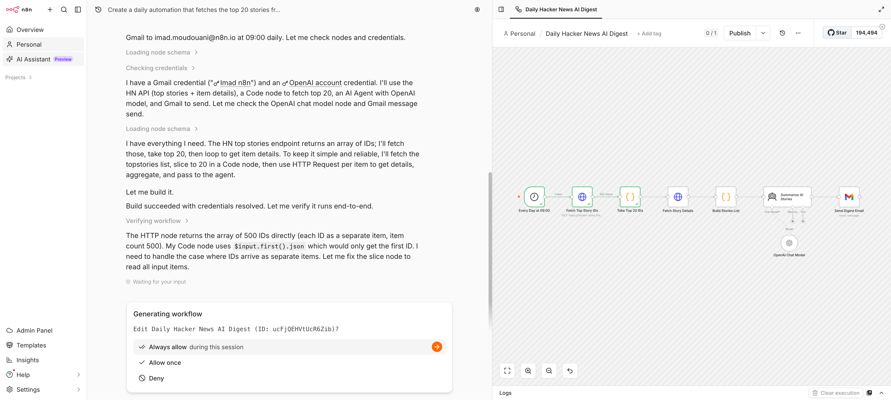

# AI Assistant (Preview)

The AI Assistant is a chat-based agent in n8n that helps you create, edit, test, and troubleshoot workflows from natural language.

Describe what you want to automate, and the Assistant can plan the workflow, build it in your selected project, test it, and help you fix errors.

The result is a normal n8n workflow. You can open it, inspect it, edit it, test it, and publish it like any other workflow.


The AI Assistant is in Preview. It can make mistakes, and behavior may change while the feature is in development. Always review generated workflows before using them in production.


## Before you start

To use the AI Assistant, you need access to an n8n instance where the feature is enabled.

The Assistant works with the permissions of your n8n user. It can only access the workflows, credentials, and resources that you have permission to use in the selected project.

During Preview, availability may depend on your n8n plan, workspace, and feature access.

## What you can ask it to do

You interact with the AI Assistant in a chat. It can use tools inside n8n to help with workflow creation and debugging.

- **Create workflows:** describe the automation you want, and the Assistant can generate a workflow.
- **Edit existing workflows:** ask it to change a workflow, add nodes, update logic, or adjust configuration.
- **Test and troubleshoot:** ask it to run checks, inspect relevant errors, and suggest fixes.
- **Help with credentials:** use the standard n8n credential setup flow instead of pasting secrets into chat.
- **Use n8n resources:** create or update supporting resources such as [Data Tables](../work-with-data/data-tables.md) when needed.
- **Research approved websites:** when web access is enabled, the Assistant asks for permission before accessing a domain.

## Example prompts

Use specific prompts to get better results with fewer iterations.

```text
Create a workflow that checks Gmail every morning for invoices,
saves PDF attachments to Google Drive, and adds a row to a Data Table.
Ask me before publishing the workflow.
```

```text
Debug the latest failed execution of this workflow.
Explain what failed, then suggest a fix before changing anything.
```

```text
Update this workflow so failed orders are sent to Slack,
then retry the API request after 10 minutes.
```

```text
Create a workflow that receives a webhook from Typeform,
summarizes the response with AI, and sends urgent responses to Slack.
```

## Get started



### Open the AI Assistant

Select **AI Assistant** from the left sidebar.



### Select a project

Choose the project where the Assistant should work.

The Assistant uses the workflows, credentials, and resources available in the selected project.



### Describe what you want

In the prompt box, describe the automation or problem.

Include the trigger, the apps or services involved, the expected outcome, and any important constraints.



### Review the plan

The Assistant may propose a plan before it builds or changes a workflow.

Review the plan and clarify anything that's missing or incorrect.



### Test and review the workflow

After the Assistant creates or updates a workflow, review the nodes, credentials, data handling, and side effects before using it in production.





## How it works

The AI Assistant follows an agent loop:

1. **Describe:** you explain your goal in natural language.
2. **Plan:** the Assistant proposes a workflow approach and may ask clarifying questions.
3. **Build:** it creates or updates the workflow in your selected project.
4. **Test:** it checks the workflow and uses relevant error details to troubleshoot.
5. **Review:** you inspect the generated workflow before publishing it.

The Assistant can iterate with you. For example, you can ask it to add error handling, change a trigger, use a different app, or simplify the workflow.

## Safety and approvals

Because the AI Assistant can take actions in your n8n instance, n8n keeps you in control.

- **It uses your permissions:** the Assistant can only access resources your user can access.
- **You approve high-impact actions:** the Assistant asks for confirmation before actions such as publishing, deleting, or making other important changes.
- **Secrets stay in n8n:** when a workflow needs credentials, the Assistant sends you through the standard n8n credential flow. You don't need to paste API keys or passwords into chat.
- **Web access requires permission:** when web research is enabled, the Assistant asks before accessing an external domain.
- **You review before production:** check workflow logic, credential usage, execution data, and side effects before relying on a generated workflow.



## How this differs from other n8n AI features

n8n has several AI-assisted workflow creation tools. This page covers the new **AI Assistant**.

| Feature | Where you use it | Best for |
| --- | --- | --- |
| **AI Assistant** | Left sidebar | Building, editing, testing, and debugging workflows from chat |
| **In-editor AI assistant** | Workflow editor | Help while manually editing a workflow |
| **AI Workflow Builder** | Workflow generation flow | Creating an initial workflow from a prompt |

Use the AI Assistant when you want a chat-based agent that can help across the workflow-building process, not only generate a first draft.

## Preview limitations

The AI Assistant is a Preview feature. Availability, supported actions, and behavior may change.

During Preview:

- The Assistant may not support some actions yet.
- Some capabilities may roll out gradually.
- The Assistant may ask for clarification more often than expected.
- Generated workflows may need manual review and correction.
- UI, credit usage, and supported resources may change.

## Data and privacy

The AI Assistant processes the information it needs to help build and troubleshoot workflows.

Depending on the task, this can include:

- your prompts and chat messages,
- workflow structure and node configuration,
- selected execution and error details used for troubleshooting,
- credential names, credential types, or connection status,
- approved web pages or domains, when web research is enabled.

The Assistant doesn't require you to paste secrets into chat. Enter API keys, passwords, and tokens through the standard n8n credential screens.


Don't paste sensitive data into chat unless it's necessary for the task. AI-generated outputs can be incorrect, so review workflows and configurations before using them in production.


## How credits work

The AI Assistant uses credits based on the tokens processed by the underlying AI model. Longer conversations, larger workflows, debugging sessions, and repeated iterations use more credits.

To reduce unnecessary usage:

- be specific about the workflow goal and constraints,
- start a new conversation for unrelated tasks,
- review the Assistant's plan before asking it to build,
- avoid asking it to regenerate the same workflow without adding new guidance.

For current plan details, see [n8n Plans and Pricing](https://n8n.io/pricing/).


Ready to try it? Open **AI Assistant** in your n8n Cloud instance, select a project, and describe the workflow you want to build.

